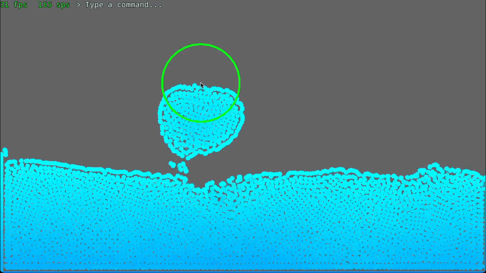

# Simple Fast Particle Simulator


The Simple Fast Particle Simulator is a high-performance C++ application built using the SFML (Simple and Fast Multimedia Library). Designed to simulate fluid dynamics, this project focuses on creating realistic particle behaviors, including density, pressure, and viscosity, to mimic the properties of water. Users can interact with the simulation by clicking and dragging with the mouse, observing real-time fluid behavior. With parallelization implemented for enhanced speed, this simulator is both powerful and efficient. The use of SFML and CMake ensures that the project is cross-platform, making it accessible for contributors on any system.

## How to use

<table>
  <tr>
    <td width=400>
      Left click and drag the mouse on the window to repell or attract nearby particles. To toggle between attract (green) and repell (red), right click. To enable debug mode, press the D key. FPS is shown on the top left of the screen. 
      <br><br>To change the behaviour of the particles, edit the 'constants.h' file to edit variables that the simulator uses.
    </td>
    <td></td>
  </tr>
</table>

## Build, Run, Contribute

This project uses a cross-platform CMake template so anyone can easily build and contribute.

1. Install [Git](https://github.com/git-guides/install-git) and [CMake](https://cmake.org/download/). Use your system's package manager if available.

2. Clone this repo recusrively:

```bash
git clone --recursive https://github.com/kareemalzahal03/Simple-Fast-Particle-Simulator.git
```

Note: If you've already cloned this repo without using `--recursive` flag, just run `git submodule update --init` to update the submodules.

3. Change directory to project root:

```bash
cd Simple-Fast-Particle-Simulator/
```

4. Add a CMake build directory:

```bash
cmake -E make_directory ./build
```

5. Generate project files: (For debug builds, replace `Release` with `Debug`)

```bash
cmake -B build -DCMAKE_BUILD_TYPE=Release
```

6. Build project: (For debug builds, replace `Release` with `Debug`)

```bash
cmake --build build --config Release
```

7. Run program: (You should find the executable under `build/bin`)

```bash
./build/bin/particle_sim
```

## License

This project is released under MIT license. See [LICENSE.md](LICENSE.md) for details. Note that this does not cover any of the submodules located under [vendor](vendors/) and assets located under [resources](resources/).

- [sfml](vendors/sfml/) is covered under [Zlib](vendors/sfml/license.md) license.

- [FiraCode-Regular.ttf](resourcs/FiraCode-Regular.ttf) is covered under [OFL-1.1](https://github.com/tonsky/FiraCode/blob/master/LICENSE) license.

## Special Thanks

[ufrshubham (aka DevKage)](https://github.com/ufrshubham):

For the cross-platform [template](https://github.com/ufrshubham/sfml-project-template) for C++ SFML projects using CMake
